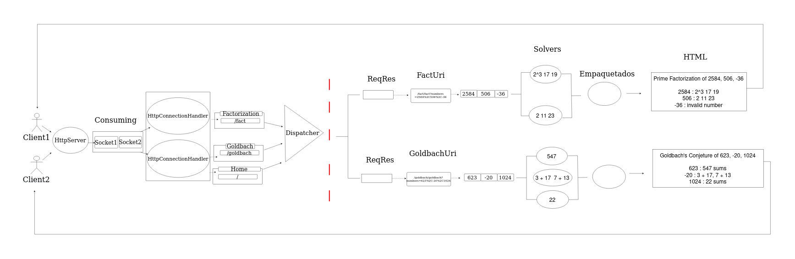
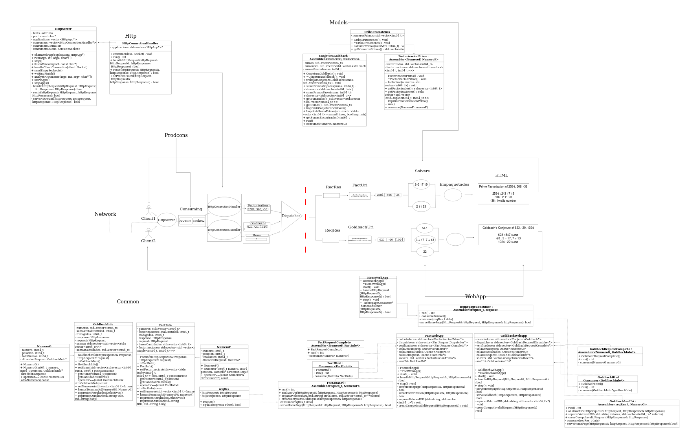

# Diseño Servidor concurrente

## **DESCRIPCIÓN DEL DISEÑO:**

### ***¿Qué representa el diseño de diagrama de flujo?***

El diseño ilustra el proceso que sigue el servidor web. En primer lugar, cuando un cliente abre el sitio web, establece una conexión de socket que se envía se envía a la clase HttpServer en el hilo principal, pero en vez de procesar las solicitudes de inmediato, se colocan en una cola de espera. 

El Dispatcher se encarga de dirigir las solicitudes HTTP, donde el analizador de las URI se encarga de obtener los números de la solicitud realizada (/fact o /goldbach) y se realizan los cálculos correspondientes con los solvers, que la cantidad de estos depende del número de CPUS disponibles o el proporcionado por argumento. 

Los resultados se almacenan en una cola de resultados y posteriormente, el requestCompleto verifica las solicitudes y si fueron completadas, se envian las respuestas para generar el HTML, dependiendo de la solicitud (Factorización Prima o Goldbach) y se muestran al cliente. 

## Diseño con UML

Además, de tener el diagrama de flujo, el diseño contempla las clases modificadas para el funcionamiento del servidor web. El UML junto al diagrama de flujo, representa las relaciones que tiene cada una de las clases para hacer las conexiones con el server, el dispatcher, las webApps y los modelos dependiendo de la solicitud realizada. 

