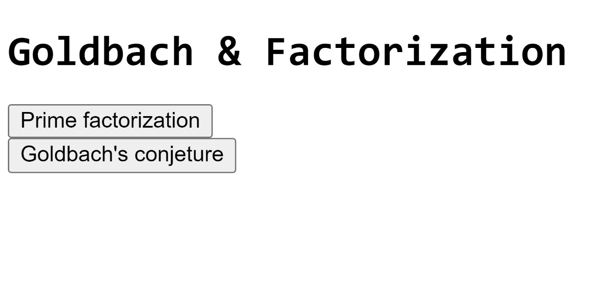
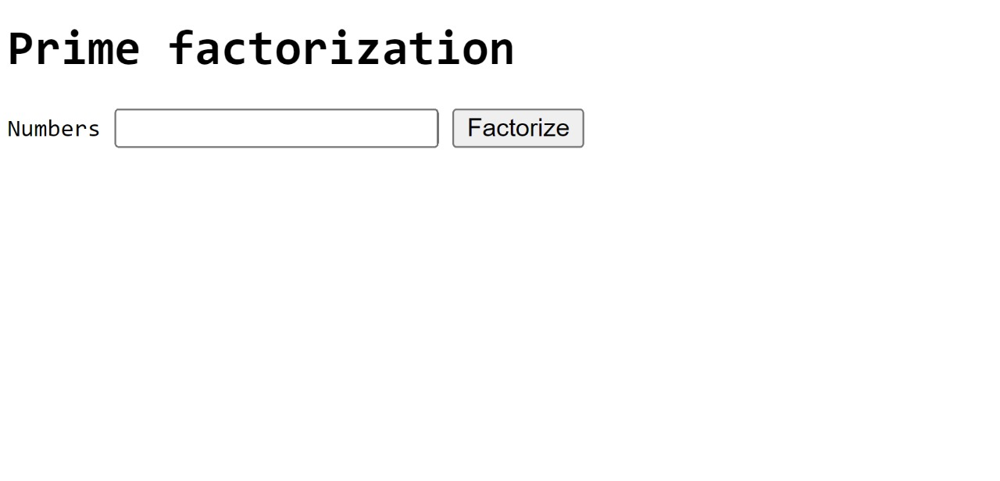
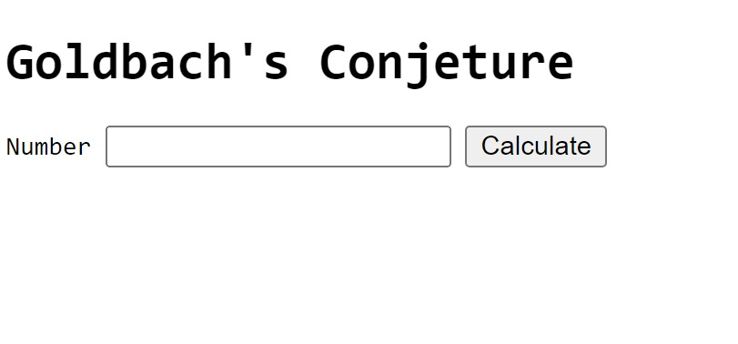
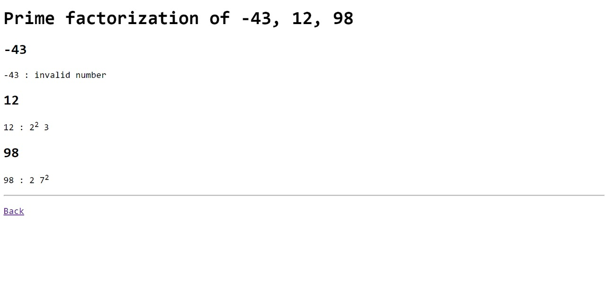
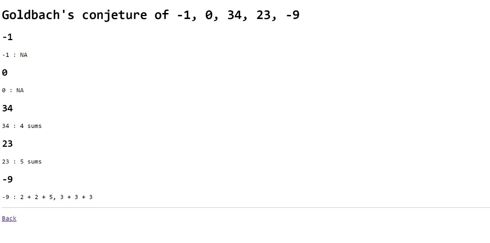
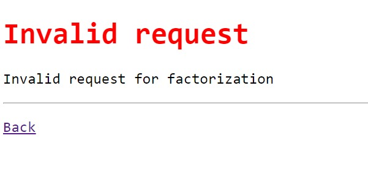

# ANÁLISIS

***

## **DESCRIPCIÓN DEL PROBLEMA:**

### ***¿En qué consiste el proyecto?***

Se busca crear un servidor web que provea webAPPs con las que resolver un problema concreto: brindar un espacio en la web, donde se pueda consultar dos cuestiones muy famosas dentro del mundo matemático: la factorización prima y la Conjetura de Goldbach. Pero antes, ¿de que tratan tales temas?


1. **La Factorización prima:** Expresión de un número como resultado del producto de factores primos.
2. **La Conjetura de Goldbach:** Todo número entero mayor que 5:
- Conjetura Fuerte-> Si es par, puede ser expresado como el total de dos números primos.
- Conjetura Débil-> Si es impar, puede ser expresado como el total de tres números primos.


De esta manera, un usuario que desea conocer cómo aplica alguna de las anteriores cuestiones a n números, podría utilizar las webAPPs que resuelven ello, sostenidas por un **servidor implementado en C++**.

### Detalles del Proyecto

- El servidor trabajará de manera concurrente
- El servidor debe ser capaz de recibir numerosas solicitudes; para ello, hará uso de threads(hilos) y hará buen uso de la concurrencia, para evitar que el usuario espere mucho tiempo o el servidor se atasque con trabajo.
- Se acepta cualquier cantidad de números, separados por coma


### Hiperenlace hacia la carpeta design

En la carpeta design se encuentra el diagrama de flujo del proyecto y pseudos utilizados para la
implementación de clases.

[Ir a la carpeta "design"](design)

***

## **MANUAL DE USO:**

### ***¿Cómo utilizar el programa?***


Debe asegurarse de tener los archivos necesarios ubicados en el .git. Una vez listos, deberá correrse por consola de comandos la instruccion *make*, que le provee el ejecutante con el que usar el programa. Introduzca en la consola de comandos la instruccion *bin/proyecto1*, donde bin es la carpeta en la que está el programa que espera ser corrido. Si lo desea, puede acompañar lo anterior indicando cuál puerto desea utilizar, pero si no lo hace, y si está disponible, por defectó será 8080:

``` sh
bin/proyecto1
```

o bien

``` sh
bin/proyecto1 1234
```

En caso de no estar disponible, verá el mensaje:
``` sh
error: no available addresses for port 8080
```
Si tiene éxito, verá el mensaje:

``` sh
Info    webserver       Listening on 0.0.0.0 port 8080
```

Una vez le aparezca el útilmo, diríjase a su buscador preferido e ingrese *localhost:8080*, como se observa en la imagen:


Una vez dentro, tendrá la opción de dirigirse al problema que desea resolver:



Para cada problema, encontrará dos sitios distintos:







Tanto para Goldbach como para la Factorización de Primos, puede ingresar uno o más números (**separados por coma**) en la caja disponible para recibir entradas, o bien, puede optar por solicitar el o los números en el mismo espacio del URL:


La salida tendrá todos los resultados, tanto para entradas válidas como inválidas, y se verá similar a esto:







Si ingresa valores inválidos, verá esto:




Cuando ya no requiera más al servidor, puede detenerle haciendo que los puertos dejen de ser escuchados y "apagando" al programa: es suficiente redirigirse a su línea de comandos y presionar *Ctrl+c*, el servidor recibirá su señal, liberará recursos y se detendrá. También, puede optar por el comando *kill*

***

## **CRÉDITOS:**

- Estudiante: Yeshúa Gabriel Ramírez Alfaro 
    - Correo: yeshua.ramirez@ucr.ac.cr
- Estudiante: Juliana Martínez Aguilar
    - Correo: juliana.martinezaguilar@ucr.ac.cr 
- Estudiante: Paula Camacho Gonzalez
    - Correo: paula.camachogonzalez@ucr.ac.cr
- Estudiante:
    - Correo: 

**Terceros:**

- Para la **Criba de Eratóstenes**, CribaEratostenes.cpp, en la rutina CribaEratostenes::calcularPrimos, se ha tomado el código de *GeeksforGeeks*, y se le han implementado modificaciones: [Código original](https://www.geeksforgeeks.org/sieve-of-eratosthenes/) 
-Para la **Factorización** de números primos, se ha tomado como referencia código de foro. 
Fernández, D. (2010).Aprende a Programar. [Código original](https://www.aprendeaprogramar.com/mod/forum/discuss.php?d=443)
