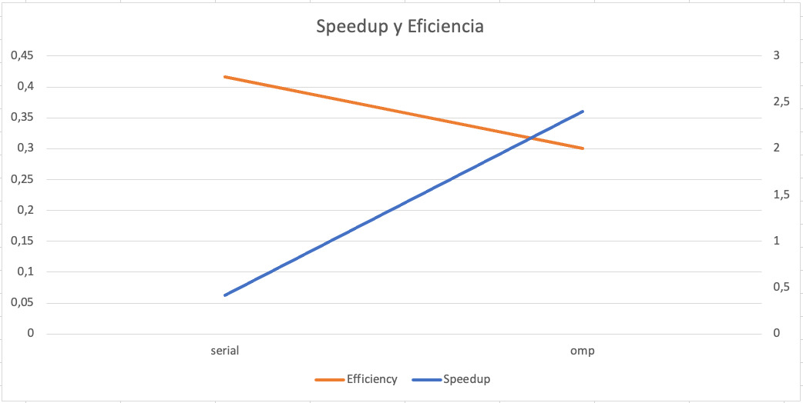
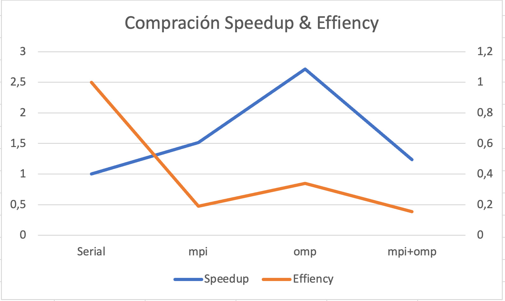

# ANÁLISIS DEL PROBLEMA

*¿En qué consiste el problema?*

Las simulaciones por computadora son muy comunes en el ámbito científico. Hay muchas áreas de estudio que requieren, constantemente, de la manipulación de materiales para diversos fines. En la mayoría de los casos el manejo de materiales involucra la observación del comportamiento de los mismos ante ciertos elementos, componentes, ambientes e, incluso, otros materiales. Ante esto, se ha implementado un programa que logra tal simulación en numerosos escenarios.

El programa logra emular el comportamiento que una placa dada, de un material específico, tendría al inyectársele ciertas temperaturas constantes en sus bordes, estudiando el tiempo que tardaría en alcanzar el punto de equilibrio térmico, a través de una fórmula en concreto que colabora con el objetivo, la cual considera temperaturas cercanas, tipo de material, tiempo transcurrido, dimensiones de la placa y sensitivida de punto de equilibrio. Esto genera un considerable ahorro de tiempo para los científicos o investigadores que le utilicen, reduciendo los tiempos de análisis de las placas de horas, días, semanas, meses o, incluso, años, a tan solo minutos.

## CONSTRUCCIÓN DE LA SOLUCIÓN

*¿Cómo compilar el código?*

Basta con tener el Makefile que el proyecto trae incluido, y pasar por la barra de comandos:

```sh
make
```

Esto le compilará y  generará el código necesario para correr el programa. Si desea más información sobre los comandos que puede aprovechar con tal archivo:

```sh
make help
```

## MANUAL DE USUARIO

*¿Cómo correr el programa?*

Usted requiere de un archivo .bin en el que se encuentren:

- las dimensiones filas x columnas de la placa.
- las temperaturas iniciales que la placa tendrá "en su centro" (excluyendo bordes), y las que serán inyectadas a sus costados. Todo esto en forma de matriz.
- Para lo anterior, considere que la placa debe estar dividida, al menos con áreas imaginarias, en segmentos. Cada segmento debe tener el mismo largo por ancho.
Puede ser más de una placa a analizar, o la misma placa pero en diferentes contexto. Para ello, provea un .txt en el que inserte diferentes placas, o una sola, con los datos correspondientes, como se muestra a continuación:

```sh
plate001.bin 1200 127 1000 2
plate001.bin 1200 127 1000 1.5
plate002.bin 60 0.08 450 0.75
```

Cada uno de los datos anteriores representan, respectivamente: Nombre del archivo con la lamina, la duración de cada etapa en segundos,
la difusividad térmica del material medida en unidades de área entre tiempo, las dimensiones de las celdas de la placa, la sensitividad del punto de equilibrio. Este último **es sumamente delicado**, pues la simulación se detiene cuando todos los cambios de temperatura en la placa han sido menores a tal valor.

### Opciones para ejecutar el programa

#### 1. Serial

Si desea ejecutar el programa serialmente, debe ubicarse en la carpeta llamada serial, compilar el programa y luego ingresar el nombre del ejecutable junto a la carpeta en la que se encuentra el txt de donde se obtiene la información de las simulaciones.

```sh
bin/heatsim tests/job001.txt 
```

#### 2. OpenMP (Open Multi-Processing)

Es una tecnología desarrollada para implementar paralelismo de datos, por lo que si desea ejecutar el programa uilizando OpenMP, debe ubicarse en la carpeta llamada openMP, una vez con todo listo, y con el programa compilado, ingresar en barra de comandos: nombre del ejecutable(programa compilado), nombre del txt en donde se encuentra la información de la o las simulaciones, cantidad de hilos a utilizar. El último, si no se provee, es tomado como la cantidad de núcleos disponibles en su máquina:

```sh
bin/heatsim tests/job001.txt 8
```

*¿Qué generará el programa?*

El programa mostrará en un .txt los resultados de la o las simulaciones, indicando cuánto tiempo le tomaría implementarla en la vida real, y cuántos cambios fueron necesarios para lograr el equilibrio térmico. Se esperaría que se observe similar a esto:

```sh
plate001.bin  1200   127  1000  2         2  0000/00/00  00:40:00
plate001.bin  1200   127  1000  1.5       3  0000/00/00  01:00:00
plate002.bin    60  0.08   450  0.75 5690 7  0000/01/09  12:27:00
```

## *Grafico de efiencia serial vs omp*



Para el análisis de los resultados, se realiza el gráfico para medir el rendimiento de la versión paralelizada.

El *eje-x* representa las soluciones serial y concurrente, el *eje-y primario* el incremento de velocidad y el *eje-y secundario* la eficiencia.

Se muestra un aumento en el speedup al emplear OpenMP en comparación con la versión serial del programa de simulación de calor, donde se obtiene una aceleración significativa en los tiempos de simulación.

Es importante destacar que, aunque la eficiencia de la versión serial es ligeramente superior, el enfoque paralelo con OpenMP al ejecutar casos de simulación más grandes podría hacer que la eficiencia sea mayor que la serial.

## *Grafico de efiencia serial vs omp vs mpi vs omp-mpi*


